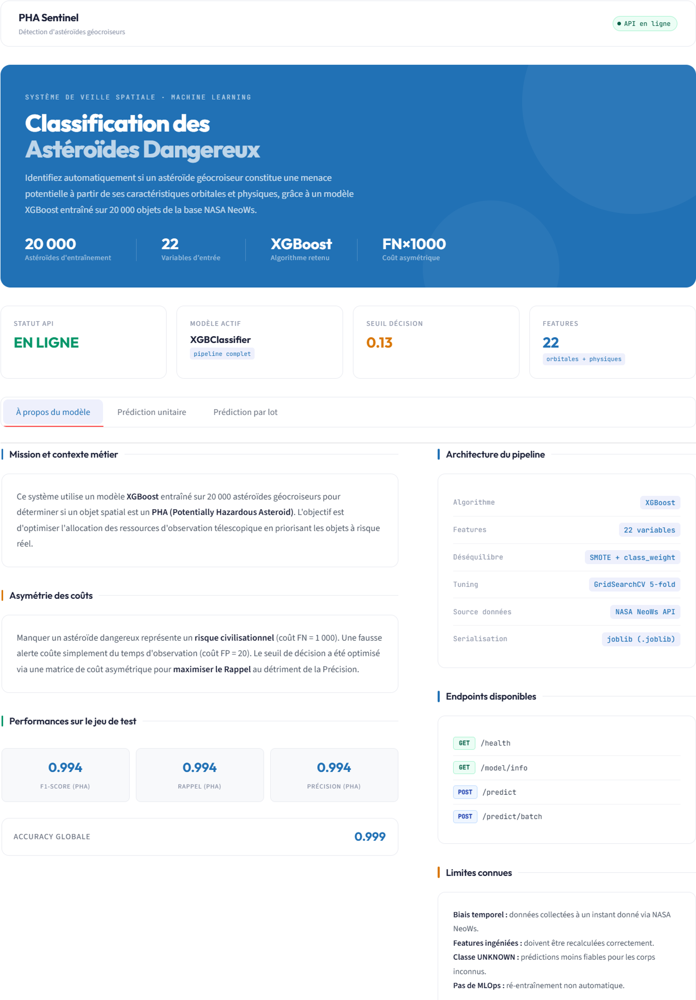
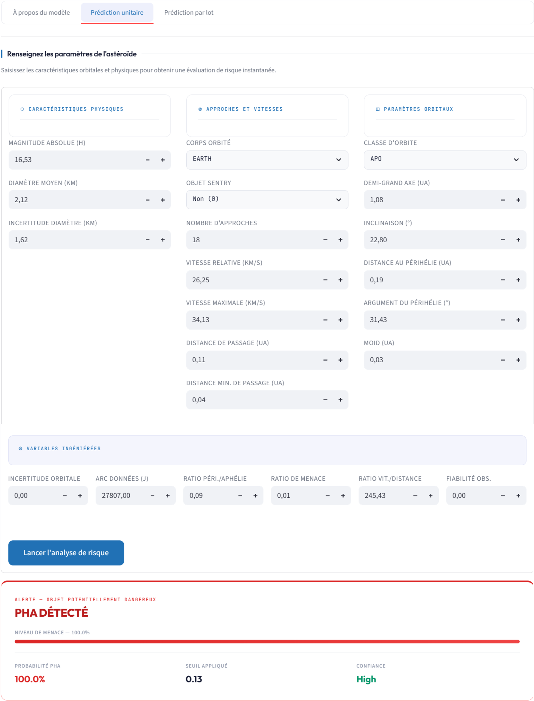
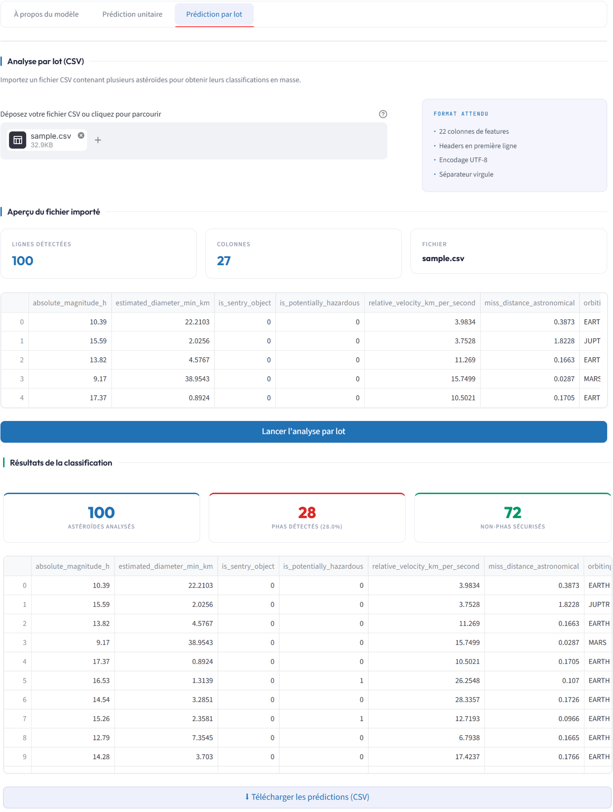
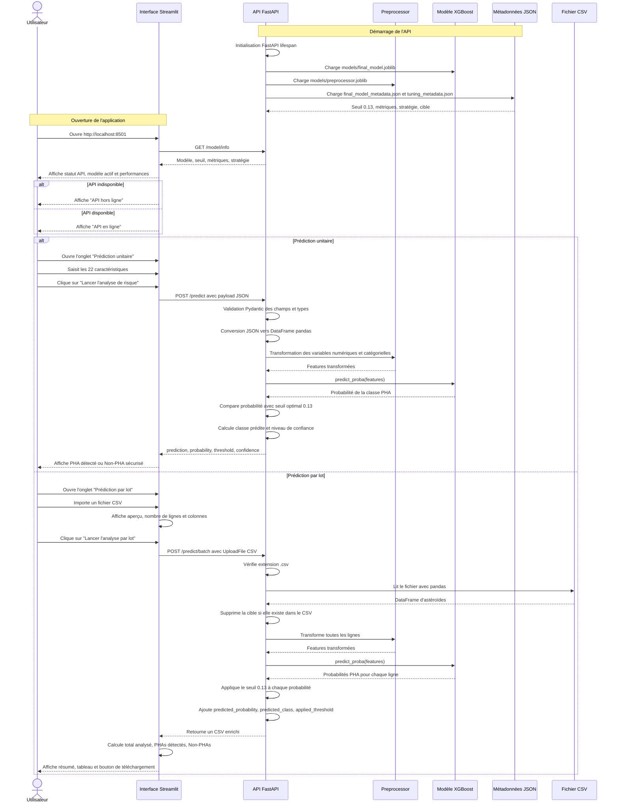
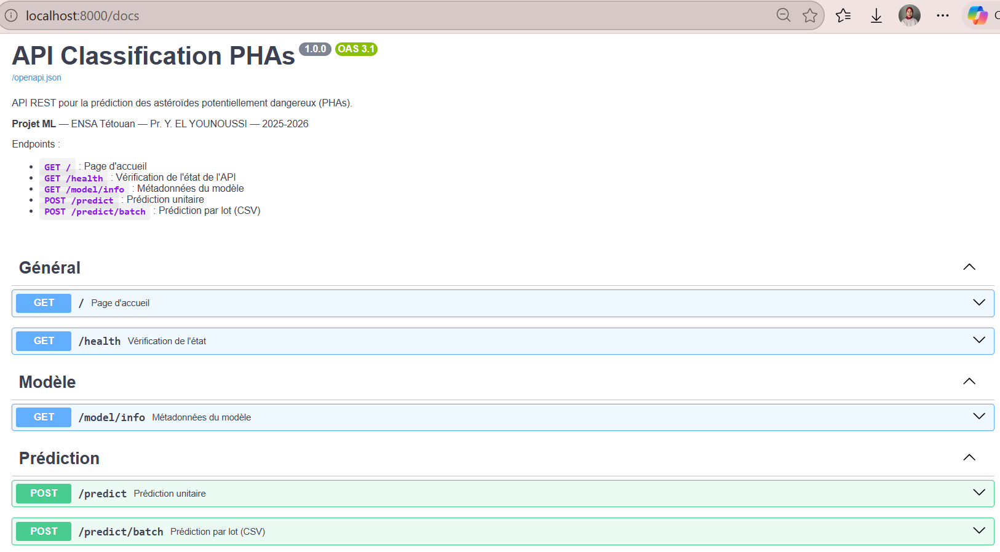

# Classification Des Astéroïdes Potentiellement Dangereux (PHAs)

Ce projet de Machine Learning permet d'identifier automatiquement si un astéroïde géocroiseur est **potentiellement dangereux (PHA)** ou **non dangereux** à partir de ses caractéristiques physiques et orbitales. Le modèle final est exposé via une **API REST FastAPI** et une **interface Streamlit** utilisable par un non-spécialiste.

**Projet de fin de module Machine Learning** - ENSA Tétouan - Pr. Yacine EL YOUNOUSSI - 2025-2026  
**Auteurs** : Bouchennou Ferdaouss · El Allouche Zakariyae · Tafraouti Sanae

---

## Captures D'écran De L'interface

### Page d'information du modèle



Cette page présente le contexte métier, l'architecture du pipeline, les performances principales, les endpoints disponibles et les limites connues du modèle.

### Formulaire de prédiction unitaire



L'utilisateur saisit les 22 variables nécessaires à la prédiction : caractéristiques physiques, paramètres d'approche, paramètres orbitaux et variables ingéniées.

### Prédiction par lot



L'utilisateur peut importer un fichier CSV contenant plusieurs astéroïdes et télécharger un fichier enrichi avec les prédictions.


---

## Installation Et Lancement

### Prérequis

Avant de lancer le projet, installer :

- **Python 3.11** recommandé
- **pip**
- **Git**
- **Docker Desktop** si vous utilisez l'option Docker

Les dépendances Python sont listées dans :

- `requirements.txt` : dépendances ML, API FastAPI et interface Streamlit

### Option 1 : Sans Docker

Cette option lance l'API et l'interface directement sur la machine.

#### Windows PowerShell

```powershell
git clone https://github.com/votre-repo/Projet_ML.git
cd Projet_ML

python -m venv venv
.\venv\Scripts\Activate.ps1

python -m pip install --upgrade pip
pip install -r requirements.txt

uvicorn app.api:app --host 0.0.0.0 --port 8000
```

Dans un deuxième terminal PowerShell :

```powershell
cd Projet_ML
.\venv\Scripts\Activate.ps1
streamlit run app/ui.py
```

#### Windows CMD

```bat
git clone https://github.com/votre-repo/Projet_ML.git
cd Projet_ML

python -m venv venv
venv\Scripts\activate.bat

python -m pip install --upgrade pip
pip install -r requirements.txt

uvicorn app.api:app --host 0.0.0.0 --port 8000
```

Dans un deuxième terminal CMD :

```bat
cd Projet_ML
venv\Scripts\activate.bat
streamlit run app/ui.py
```

#### Linux Et macOS

```bash
git clone https://github.com/votre-repo/Projet_ML.git
cd Projet_ML

python3 -m venv venv
source venv/bin/activate

python -m pip install --upgrade pip
pip install -r requirements.txt

uvicorn app.api:app --host 0.0.0.0 --port 8000
```

Dans un deuxième terminal :

```bash
cd Projet_ML
source venv/bin/activate
streamlit run app/ui.py
```

> Remarque Streamlit : lors du premier lancement local, Streamlit peut afficher `Email:` dans le terminal. Il suffit de laisser ce champ vide et d'appuyer sur **Entrée**. L'interface démarre ensuite et affiche l'URL locale `http://localhost:8501`.

Services disponibles après lancement :

- API : [http://localhost:8000](http://localhost:8000)
- Interface Streamlit : [http://localhost:8501](http://localhost:8501)
- Swagger : [http://localhost:8000/docs](http://localhost:8000/docs)

### Option 2 : Avec Docker

Cette option est recommandée pour la démonstration finale, car elle lance l'API et l'interface avec une seule commande.

#### Windows, Linux Et macOS

```bash
git clone https://github.com/votre-repo/Projet_ML.git
cd Projet_ML

docker-compose up --build
```

Services disponibles :

- API : [http://localhost:8000](http://localhost:8000)
- Interface Streamlit : [http://localhost:8501](http://localhost:8501)
- Swagger : [http://localhost:8000/docs](http://localhost:8000/docs)

Arrêter l'application :

```bash
docker-compose down
```

Reconstruire proprement les conteneurs si nécessaire :

```bash
docker-compose down
docker-compose up --build
```

---

## Exemple D'utilisation

### Tester L'état De L'API

```bash
curl http://localhost:8000/health
```

Réponse attendue :

```json
{
  "status": "ok",
  "message": "API and model are operational"
}
```

### Obtenir Les Informations Du Modèle

```bash
curl http://localhost:8000/model/info
```

Cet endpoint retourne notamment le modèle utilisé, la stratégie retenue, le seuil de décision et les métriques principales.

### Prédiction Unitaire Avec `curl`

```bash
curl -X POST http://localhost:8000/predict \
  -H "Content-Type: application/json" \
  -d '{
    "absolute_magnitude_h": 16.53,
    "is_sentry_object": 0,
    "relative_velocity_km_per_second": 26.25,
    "miss_distance_astronomical": 0.106,
    "orbiting_body": "EARTH",
    "n_approaches": 18,
    "min_miss_distance_au": 0.039,
    "max_velocity_km_s": 34.13,
    "semi_major_axis": 1.078,
    "inclination": 22.8,
    "perihelion_distance": 0.186,
    "perihelion_argument": 31.43,
    "orbit_uncertainty": 0.0,
    "minimum_orbit_intersection": 0.033,
    "data_arc_in_days": 27807.0,
    "orbit_class_type": "APO",
    "diameter_mean_km": 2.12,
    "diameter_uncertainty": 1.62,
    "perihelion_to_aphelion_ratio": 0.094,
    "threat_ratio": 0.015,
    "velocity_distance_ratio": 245.43,
    "observation_reliability": 0.0
  }'
```

Exemple de réponse :

```json
{
  "prediction": "PHA (Risque élevé)",
  "probability": 0.98,
  "threshold": 0.13,
  "confidence": "high"
}
```

### Prédiction Par Lot

```bash
curl -X POST http://localhost:8000/predict/batch \
  -F "file=@test_api.csv" \
  --output predictions.csv
```

Le fichier `predictions.csv` contient les colonnes originales du fichier envoyé, plus :

- `predicted_probability`
- `predicted_class`
- `applied_threshold`

### Flow Utilisateur Détaillé



1. L'utilisateur lance l'application avec Docker ou en mode local.
2. Il ouvre l'interface Streamlit sur [http://localhost:8501](http://localhost:8501).
3. Il consulte l'onglet **À propos du modèle** pour vérifier que l'API est en ligne, consulter le modèle actif, le seuil de décision, les performances et les limites.
4. Pour une prédiction unitaire, il ouvre l'onglet **Prédiction unitaire**.
5. Il renseigne les caractéristiques physiques : magnitude absolue, diamètre moyen et incertitude du diamètre.
6. Il renseigne les caractéristiques d'approche : corps orbité, objet Sentry, nombre d'approches, vitesses et distances de passage.
7. Il renseigne les paramètres orbitaux : classe d'orbite, demi-grand axe, inclinaison, périhélie, argument du périhélie et MOID.
8. Il renseigne les variables ingéniées : ratio périhélie/aphélie, ratio de menace, ratio vitesse/distance et fiabilité d'observation.
9. Il clique sur **Lancer l'analyse de risque**.
10. L'interface envoie automatiquement les données à l'endpoint `/predict` de l'API FastAPI.
11. L'API applique le pipeline complet : preprocessing, modèle XGBoost, probabilité PHA et seuil optimal de `0.13`.
12. L'utilisateur reçoit une décision lisible : **PHA (Risque élevé)** ou **Non-PHA (Risque faible)**, avec la probabilité et le niveau de confiance.
13. Pour un traitement en masse, il ouvre l'onglet **Prédiction par lot**.
14. Il importe un fichier CSV contenant les 22 colonnes de features attendues.
15. L'interface appelle l'endpoint `/predict/batch` et affiche un résumé du nombre d'astéroïdes analysés, PHAs détectés et Non-PHAs.
16. L'utilisateur télécharge le CSV enrichi avec les prédictions.

---

## Architecture Du Dépôt

```text
Projet_ML/
├── app/
│   ├── api.py                  # API REST FastAPI : accueil, health, info, predict, batch
│   └── ui.py                   # Interface Streamlit pour utilisateur final
├── data/
│   ├── dataset.csv             # Dataset complet construit depuis l'API NASA NeoWs
│   ├── sample.csv              # Extrait de 100 lignes
│   └── processed/
│       ├── train.csv           # Données d'entraînement stratifiées
│       ├── val.csv             # Données de validation stratifiées
│       └── test.csv            # Données de test final stratifiées
├── models/
│   ├── preprocessor.joblib     # ColumnTransformer sérialisé
│   ├── tuned_model.joblib      # Modèle optimisé
│   ├── final_model.joblib      # Pipeline complet + seuil optimal
│   ├── final_model_metadata.json # Métadonnées du modèle final
│   ├── tuning_metadata.json    # Métadonnées du tuning
│   ├── modeling_results.csv    # Comparaison des configurations
│   ├── tuning_results.csv      # Résultats du tuning
│   ├── validation_results.csv  # Résultats de validation
│   └── threshold_analysis.csv  # Analyse des seuils
├── notebooks/
│   ├── 01_discovery.ipynb      # Découverte initiale du dataset
│   ├── 02_eda.ipynb            # Analyse exploratoire
│   ├── 03_preprocessing.ipynb  # Préparation, split et pipeline
│   ├── 04_modeling.ipynb       # Modélisation : 4 modèles x 3 stratégies
│   ├── 05_tuning.ipynb         # Optimisation des hyperparamètres
│   └── 06_evaluation.ipynb     # Évaluation finale et seuil métier
├── src/
│   └── data_collection.py      # Collecte NASA NeoWs et constitution du dataset
├── docs/
│   └── screenshots/            # Captures d'écran utilisées dans ce README
├── test_api.csv                # Exemple de fichier pour prédiction batch
├── dockerfile                  # Image Docker Python 3.11
├── docker-compose.yml          # Orchestration API + UI
├── requirements.txt            # Dépendances ML + API + interface
├── cadrage.md                  # Cadrage métier et objectifs ML
├── DATASET.md                  # Documentation du dataset
├── preprocessing_decisions.md  # Décisions de preprocessing
└── README.md                   # Documentation principale
```

---

## Documentation Swagger

La documentation Swagger est générée automatiquement par FastAPI et permet de tester tous les endpoints sans écrire de code.

Lien principal :

- **Swagger UI** : [http://localhost:8000/docs](http://localhost:8000/docs)
- **ReDoc** : [http://localhost:8000/redoc](http://localhost:8000/redoc)

Capture Swagger :



Endpoints disponibles :

| Endpoint | Méthode | Rôle |
|----------|---------|------|
| `/` | GET | Page d'accueil de l'API |
| `/health` | GET | Vérifier que l'API et le modèle sont opérationnels |
| `/model/info` | GET | Afficher les métadonnées du modèle |
| `/predict` | POST | Faire une prédiction unitaire |
| `/predict/batch` | POST | Faire une prédiction sur un fichier CSV |

---

## Modèle Et Données

| Élément | Détail |
|---------|--------|
| Domaine | Défense planétaire / astéroïdes géocroiseurs |
| Source des données | NASA NeoWs API |
| Taille du dataset | 20 000 astéroïdes |
| Tâche ML | Classification binaire supervisée |
| Variable cible | `is_potentially_hazardous` |
| Classe minoritaire | 9,75 % de PHAs |
| Algorithme final | XGBoost |
| Nombre de features utilisées | 22 |
| Seuil de décision | 0,13 |
| Coût métier | FN=1000, FP=20 |
| Métriques principales | F1-score, Recall, Precision, PR-AUC |

Performances principales sur le jeu de test :

| Métrique PHA | Valeur |
|--------------|--------|
| Precision | 0,9936 |
| Recall | 0,9936 |
| F1-score | 0,9936 |
| Accuracy globale | 0,9988 |

---

## Limites Connues Du Modèle

1. **Biais temporel** : le modèle est entraîné sur des données collectées à un instant donné via l'API NASA NeoWs. Les nouveaux astéroïdes découverts après cette date ne sont pas pris en compte.
2. **Dépendance aux variables ingéniées** : les variables `threat_ratio`, `velocity_distance_ratio`, `observation_reliability`, etc. doivent être recalculées correctement pour toute nouvelle donnée.
3. **Valeurs inconnues** : les modalités `UNKNOWN` dans `orbiting_body` ou `orbit_class_type` peuvent réduire la fiabilité de certaines prédictions.
4. **Pas de ré-entraînement automatique** : le modèle n'est pas relié à une chaîne MLOps ; un nouveau dataset nécessiterait un ré-entraînement manuel.
5. **Signal métier très fort** : certaines variables, notamment `diameter_mean_km` et `minimum_orbit_intersection`, sont directement liées aux critères NASA de classification PHA.

---

## Licence

Ce projet est réalisé dans un cadre académique à l'ENSA Tétouan pour l'année universitaire 2025-2026. Toute réutilisation doit mentionner les auteurs, l'encadrant et le contexte d'origine du projet.
